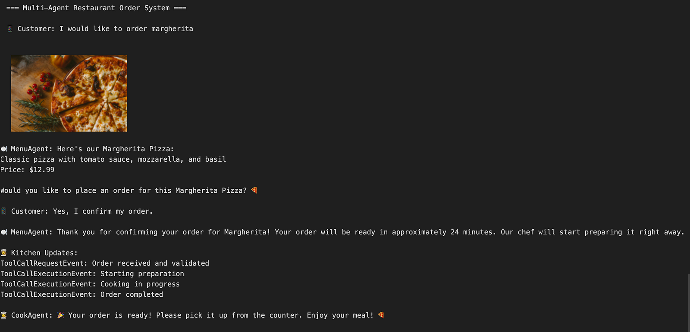

# Restaurant Ordering System

This demo showcases a **multi-agent restaurant ordering system** using AutoGen. It demonstrates how multiple agents can collaborate to handle restaurant-related tasks, including managing a menu, processing orders, and providing real-time updates.

> **Check out the full step-by-step guide on Medium**: [Building a Multi-Agent Restaurant System with AutoGen](https://jaythakur.medium.com/building-a-multi-agent-restaurant-system-with-autogen-b4aa9518738c)

---

## Features
- **Menu Management**: The `MenuAgent` handles customer queries about menu items and validates orders.
- **Order Processing**: The `CookAgent` simulates the cooking process and sends updates to the customer.
- **Flexible Environment**: The system supports both Python scripts (for terminal use) and Jupyter Notebooks (for an interactive experience).

---

## Architecture

The high-level architecture of the system is as follows:


---

## How It Works

1. **Customer Requests an Item**:
   The customer places an order for a menu item (e.g., `"I would like to order pepperoni pizza"`).

2. **MenuAgent Validates and Responds**:
   - The `MenuAgent` checks the menu and provides details, including an image of the requested item.
   - Example output in Jupyter Notebook:
     

   - Example output in the terminal:
     

3. **Customer Confirms the Order**:
   - The customer confirms their order (e.g., `"Yes, I confirm my order"`).

4. **CookAgent Processes the Order**:
   - The `CookAgent` simulates the cooking process, providing real-time updates such as:
     - Order received
     - Cooking in progress
     - Order completed

5. **Order Completion**:
   - The `CookAgent` notifies the customer when the order is ready.

6. **Error Handling**:
   - If a customer requests an invalid item, the `MenuAgent` gracefully handles the error:
     

---

## Sequence Diagram

Below is a detailed sequence diagram of the multi-agent interaction:


---

## How to Run

1. **Clone the Repository**:
   ```bash
   git clone https://github.com/your-username/autogen-demos.git
   cd autogen-demos/restaurant_ordering
2. Install Dependencies:
    ```bash
    pip install -r ../../requirements.txt`
3. Run the Demo:
    Jupyter Notebook: Open restaurant_ordering.ipynb in Jupyter Notebook and follow the step-by-step instructions.
    Python Script: Run the script in the terminal:
    ```bash
    python3 restaurant_ordering.py

